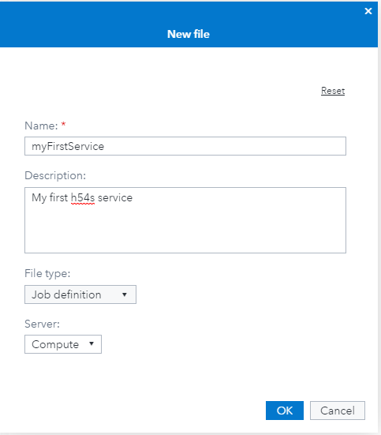

# HTML5 Data Adapter for SAS&reg; (H54S)
[](https://badge.fury.io/js/h54s)
[](https://packagephobia.now.sh/result?p=h54s)
[](https://img.shields.io/npm/dm/h54s)
[](https://gitter.im/Boemska/h54s?utm_source=badge&utm_medium=badge&utm_campaign=pr-badge&utm_content=badge)

## What is H54S?

H54S is a library that facilitates and manages seamless bi-directional communication between a HTML5 (JavaScript) based Web Application and back-end data services written in SAS and deployed on the SAS Enterprise BI platform. It lets Web Programmers and SAS Developers collaborate easily to build general purpose Web Applications with unprecedented speed and agility.

Yes. Unprecedented.

#### Server Requirements

- SAS BI Platform (v9.4) or SAS Viya (3.5 or later)
- SAS Stored Process Web Application (Integration Technologies)

#### Client Requirements

- A decent Web Browser. It'll work on IE8, but spare yourself the pain
- Your Web Application Framework or Library of choice
- Bower.js and Google Chrome recommended. Having Git installed is also useful.

## Why is it called H54S?

While we're reasonably decent with technology, we are seemingly terrible with names. If anyone can think of a name that doesn't sound like a strain of Bird Flu, we're open to suggestions.

## Great. How do I get started?

Clone this repository to somewhere local:

```
git clone https://github.com/Boemska/h54s
```

Then put your SAS hat on. 

Depending on what version you are running you can either use SAS9 or Viya

### SAS9

1. Copy the `sasautos` directory to your SAS Application Server. For this example we copied ours to `/pub/sasautos`.

2. Register a new SAS Stored Process, with Streaming output enabled. We called our Stored Process `/Apps/myFirstService`.

3. Set this to be the body of your program:

```sas
* get H54s (from wherever you placed it in step 1) ;
%include '/pub/apps/h54s/sasautos/h54s.sas';

* Process and receive datasets from the client ;
%bafgetdatasets();
resetline;

* Do some SAS. Can be Anything. Merge and sort as an example ;
data mydata;
  set sashelp.class;
run;

proc sort data=mydata;
  by name;
run;

* Return a resulting dataset to the client ;
%bafheader()
  %bafOutDataset(processed, work, myData)
%bafFooter()
```

4. Save your Stored Process.  If you are using Enterprise Guide to do this, be sure to check "Global Macro Variables" and uncheck "Include STP Macros" under the "Include code for" dropdown.

5. Log on to your SAS Stored Process Web Application and run the STP. It should produce something like this output:

```json
{ "processed" : [{"Name":"Alfred","Sex":"M","Age":14,"Height":69,"Weight":112.5},{"Name":"Alice","Sex":"F","Age":13,"Height":56.5,"Weight":84},{"Name":"Barbara","Sex":"F","Age":13,"Height":65.3,"Weight":98},{"Name":"Carol","Sex":"F","Age":14,"Height":62.8,"Weight":102.5},{"Name":"Henry","Sex":"M","Age":14,"Height":63.5,"Weight":102.5},{"Name":"James","Sex":"M","Age":12,"Height":57.3,"Weight":83},{"Name":"Jane","Sex":"F","Age":12,"Height":59.8,"Weight":84.5},{"Name":"Janet","Sex":"F","Age":15,"Height":62.5,"Weight":112.5},{"Name":"Jeffrey","Sex":"M","Age":13,"Height":62.5,"Weight":84},{"Name":"John","Sex":"M","Age":12,"Height":59,"Weight":99.5},{"Name":"Joyce","Sex":"F","Age":11,"Height":51.3,"Weight":50.5},{"Name":"Judy","Sex":"F","Age":14,"Height":64.3,"Weight":90},{"Name":"Louise","Sex":"F","Age":12,"Height":56.3,"Weight":77},{"Name":"Mary","Sex":"F","Age":15,"Height":66.5,"Weight":112},{"Name":"Philip","Sex":"M","Age":16,"Height":72,"Weight":150},{"Name":"Robert","Sex":"M","Age":12,"Height":64.8,"Weight":128},{"Name":"Ronald","Sex":"M","Age":15,"Height":67,"Weight":133},{"Name":"Thomas","Sex":"M","Age":11,"Height":57.5,"Weight":85},{"Name":"William","Sex":"M","Age":15,"Height":66.5,"Weight":112}], "usermessage" : "blank", "logmessage" : "blank", "requestingUser" : "jim", "requestingPerson" : "Dr Jim", "executingPid" : 22087, "sasDatetime" : 1906249007.8 , "status" : "success"}
```

This is good enough for now. Time for some Front End Development.

### SAS Viya

1. Copy the `sasautos` directory to your SPRE node. For this example we copied ours to `/pub/sasautos`.

2. Register a new SAS Job Definition in a folder that you can write to. I created mine in my users' home folder and called it `myFirstService`:



3. Right click on the job and select Edit > Source code. Paste in the following code:

```sas
* get H54s (from wherever you placed it in step 1) ;
%include '/pub/apps/h54s/sasautos/h54s.sas';

* Process and receive datasets from the client ;
%bafgetdatasets();
resetline;

* Do some SAS. Can be Anything. Merge and sort as an example ;
data mydata;
  set sashelp.class;
run;

proc sort data=mydata;
  by name;
run;

* Return a resulting dataset to the client ;
%bafheader()
  %bafOutDataset(processed, work, myData)
%bafFooter()
```

Now, the eagle-eyed among you will notice that this is exactly the same code as for SAS9. No code changes are required to deploy h54s apps across the two platforms. 

4. Right click on the job name and select properties. From the properties menu select "Parameters". Add the following parameter and then click save:
  * Name: `_output_type`
  * Default value: `html`
  * Field type: `Character`
  * Required: `false`

5. Run your job by right clicking on it and selecting "Submit job". You should see some output like the following:

```json
{ "processed" : [{"Name":"Alfred","Sex":"M","Age":14,"Height":69,"Weight":112.5},{"Name":"Alice","Sex":"F","Age":13,"Height":56.5,"Weight":84},{"Name":"Barbara","Sex":"F","Age":13,"Height":65.3,"Weight":98},{"Name":"Carol","Sex":"F","Age":14,"Height":62.8,"Weight":102.5},{"Name":"Henry","Sex":"M","Age":14,"Height":63.5,"Weight":102.5},{"Name":"James","Sex":"M","Age":12,"Height":57.3,"Weight":83},{"Name":"Jane","Sex":"F","Age":12,"Height":59.8,"Weight":84.5},{"Name":"Janet","Sex":"F","Age":15,"Height":62.5,"Weight":112.5},{"Name":"Jeffrey","Sex":"M","Age":13,"Height":62.5,"Weight":84},{"Name":"John","Sex":"M","Age":12,"Height":59,"Weight":99.5},{"Name":"Joyce","Sex":"F","Age":11,"Height":51.3,"Weight":50.5},{"Name":"Judy","Sex":"F","Age":14,"Height":64.3,"Weight":90},{"Name":"Louise","Sex":"F","Age":12,"Height":56.3,"Weight":77},{"Name":"Mary","Sex":"F","Age":15,"Height":66.5,"Weight":112},{"Name":"Philip","Sex":"M","Age":16,"Height":72,"Weight":150},{"Name":"Robert","Sex":"M","Age":12,"Height":64.8,"Weight":128},{"Name":"Ronald","Sex":"M","Age":15,"Height":67,"Weight":133},{"Name":"Thomas","Sex":"M","Age":11,"Height":57.5,"Weight":85},{"Name":"William","Sex":"M","Age":15,"Height":66.5,"Weight":112}], "usermessage" : "blank", "logmessage" : "blank", "requestingUser" : "jimdemo", "requestingPerson" : "jimdemo", "executingPid" : 1054, "sasDatetime" : 1906323243.9 , "status" : "success"}
```

This is good enough for now. Time for some Front End Development.

## HTML5 Front End

Assuming that you have a local Web Server installed for development:

1. Create an `index.html` or start a new project in your chosen IDE.

2. Copy the `/dist/h54s.js` file to your project and include it. Your `index.html` might look like this:

```html
<!DOCTYPE html>
<html>
  <body>
    <script src="h54s.js"></script>
    <h1>Look Ma, Front End!</h1>
  </body>
</html>
```

For IE, you may need to add `<meta http-equiv="X-UA-Compatible" content="IE=edge;" />`.

3. *If you are hosting your index.html and project files from within a deployed static.war, or behind the same reverse proxy as your SPWA, you don't need this step. Otherwise, for most people:*

   Fire up your browser. This is where Chrome comes in handy, as it allows developers to disable [Same-Origin Policy](https://en.wikipedia.org/wiki/Same-origin_policy). To tell your browser to allow background requests to non-local pages while you develop, you need to start Chrome with the `--disable-web-security` command line flag.  For example, on Mac OS, first close Chrome and run the following in the Terminal:  `open /Applications/Google\ Chrome.app --args --disable-web-security`
When you see this warning, you're in business:

   

3. Load your `index.html` page, Open Chrome Developer Tools (F12), Open the Console tab.

4. Create an instance of the adapter. In the console, try typing `h5`... Chrome should autocomplete to `h54s`, meaning the script is sourced correctly.

   Assuming your SAS webapp URIs are the default `SASStoredProcess` and `SASLogon`, the following should be enough to get you started:

```javascript
// Instantiate adapter. If SPWA was located at
// http://myServer:8080/SASStoredProcess/, you would do a
var adapter = new h54s({hostUrl: 'http://myServer:8080/'});
// (note trailing slash)

// then create a dataset to send to SAS, which in JS is an
// object array that looks a bit like this
var myFirstTable = [
  { name: 'Allan', sex: 'M', weight: 101.1 },
  { name: 'Abdul', sex: 'M', weight: 133.7 }
];

// add it to a h54s SasData object
var data = new h54s.SasData(myFirstTable, 'datain');

// make your first call to SAS
adapter.call('/Apps/myFirstService', data, function(err, res) {
  if(err) {
    //Houston we have a problem
    console.log(err);
  } else {
    //res is an object returned from the server
    console.log(res);
  }
});
```
If you're logged into your SPWA and have a session cookie already, you should see this:

   

Otherwise, if you're not logged in yet, you should see this:

   

The easist thing to do at this point is to log into your SPWA in another tab, refresh your page and try running the code again. However, if you're feeling adventurous you could skip ahead and try this in the console:

```javascript
adapter.login('mysasusername','mysaspassword'); // More on this later
```

Any queued `adapter.call()` calls should resume after a successful `adapter.login()`.

### What just happened? What did I do?

First, we registered a SAS Stored Process based back-end service. We told it to expect a data structure called `datain` and to convert it to a temporary table called `WORK.ADDITIONS`. Then, using `%bafErrorCheck` we instructed it to halt processing the rest of the SAS program if the expected data wasn't sent by the client.

When the table arrived as expected, the program would do some SAS-based stuff (which given the power and flexibility of SAS could have been anything, from a secured lookup into a legacy mainframe-based system so you can pre-populate a form, to an on-the-fly Hadoop query built into your app). For this example, we just told it to merge the input dataset with a few records from the good old `SASHELP.CLASS` into a new temporary dataset called `WORK.MYDATA`, sort it, and return the resulting dataset to the client as an object array called `processed`.

Then, from the Web side, we started a new project by creating an `index.html` page which sources the client-side `h54s.js` script. We then used the Chrome Dev Console to run some JavaScript code - to create a configured instance of the h54s Adapter, create a sample dataset, attach that dataset to a call to SAS as `datain`, fire it over, and use a simple function to either show us the dataset that was returned by SAS as `processed`, or have a look at any errors that might have occured.

Easy, right? Read on.

## Data Structures and Conventions

The *Atomic Unit of Data transfer* for a H54S based App is the Dataset. This is a universal concept familiar to both JS and SAS programmers. In JavaScript Speak, a Dataset is an [object array](http://www.w3schools.com/js/js_json_syntax.asp), similar to the one created in the example above. Using [this terminology](http://www.w3schools.com/js/js_arrays.asp), each object in an array is the row of a dataset, and each of it's named members is the value of a variable of the same name.

Data Types between the front-end and back-end are mapped as follows:

#### JavaScript to SAS

| JavaScript | SAS      | Notes                                                                   |
|------------|----------|-------------------------------------------------------------------------|
| String     | String   | ASCII only at the moment. Working on UTF support                        |
| Numeric    | Numeric  | Same precision in both SAS and JS. Enforced.                            |
| Boolean    |          | Not permitted by adapter. Throws typeError. Use numerics for bools.     |
| Null       |          | Ignored. The value for the column is not included for that row.         |
| Undefined  |          | Same as Null                                                            |

To send dates to SAS, use `h54s.toSasDateTime(date)` to convert instance of `Date` object to numeric SAS date value.

#### SAS to JavaScript

| SAS      | JavaScript | Notes                                                                                               |
|----------|------------|-----------------------------------------------------------------------------------------------------|
| String   | String     | NewLine characters are stripped.                                                                    |
| Numeric  | Numeric    | Same precision in both SAS and JS.                                                                  |
| Datetime | Date()     | SAS Datetime columns are converted to Date() objects if their column name is prefixed with 'DT_' (by default, conditional can be edited [here](https://github.com/Boemska/h54s/blob/master/dist/h54s.js#L948))    |
| Date     |            | Unsupported. You won't be able to transmit data as SAS Dates. Convert, use output views and DHMS()   |

To parse numeric dates sent from SAS, use `h54s.fromSasDateTime(date)` to convert numeric SAS date value to JavaScript `Date` object

### But what about Parameters? I'm used to Parameters

Say goodbye to Parameters. For the purposes of H54S-based apps, Datasets supersede them. Input validation and typechecking should be done by your JavaScript app, and the Adapter ensures type safety and handles exceptions. If you're just looking to pass a single value back, you'll need to use a 'single-column, single-row table'. It might not seem like it to start with, but it's a blessing once you start working with multiple programmers and writing interface specifications.

To get a control table with some parameters, your JS code would look like this:
```javascript
var paramsRow={};
    paramsRow.myStringParam = 'stuff and things';
    paramsRow.myNumericParam = 123.123;
    paramsRow.myDatetimeParam = new Date();

var paramTable = [paramsRow];

    data.addTable(paramTable,'controlTable');
```

and the following SAS code would get you a table called `WORK.CONTROL` with three columns and one row:

```sas
%bafGetDataset(controlTable, WORK.CONTROL);
```

Voila.

## Development and Testing of JS adapter code

We love contributions!  If you'd like to get involved, check out the [build instructions](CONTRIBUTIONS.md).


## Any questions or comments? Come join the chat. [](https://gitter.im/Boemska/h54s?utm_source=badge&utm_medium=badge&utm_campaign=pr-badge&utm_content=badge)
